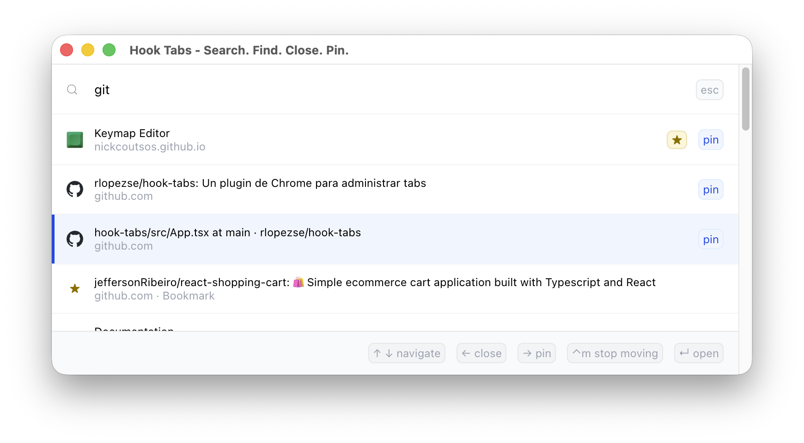
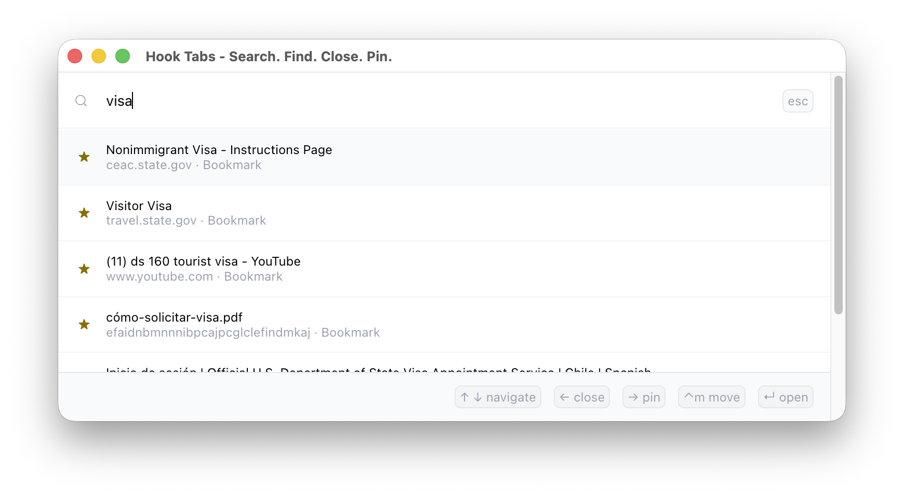
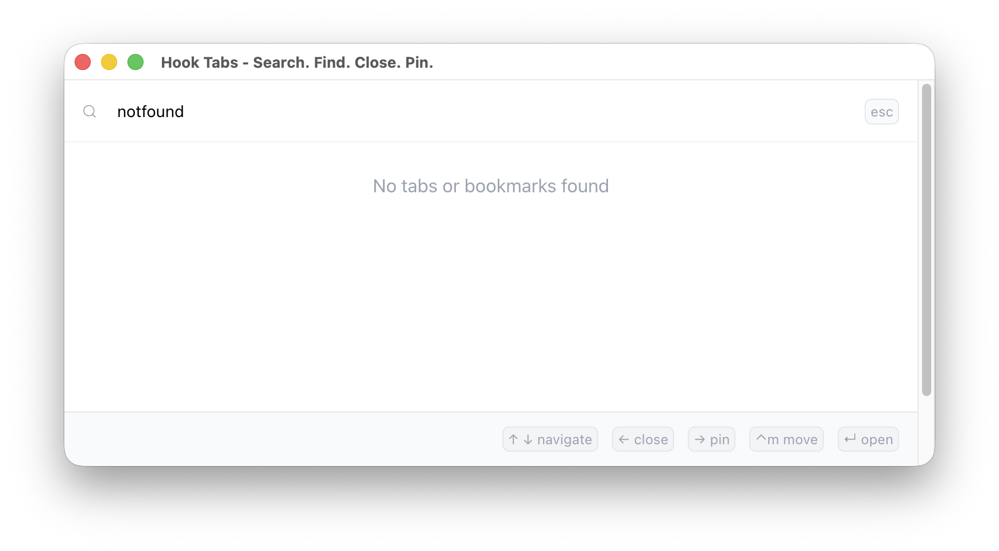

# Hook Tabs

Hook Tabs es un proyecto personal que creé porque me cansé de tener que recorrer pestaña por pestaña para encontrar una en particular, o depender del mouse para hacerlo.

La idea es bastante simple: abrir Hook Tabs, buscar lo que necesitas y listo. Puedes cambiar de pestaña, cerrarla, pinearla o moverla sin tener que andar buscando entre todas las pestañas abiertas.

Ahora también puedes buscar entre tus marcadores, directamente desde la misma interfaz.

Por ahora decidí mantenerlo simple y directo. Hay varias cosas que me gustaría mejorar y agregar en el futuro, pero preferí partir con algo pequeño que resolviera el problema que tenía.

### Atajos

- `↑ ↓` Navegar entre resultados
- `←` Cerrar pestaña
- `→` Pinear / despinear pestaña
- `M` Mover pestaña
- `Enter` Abrir pestaña o marcador
- `Esc` Cerrar Hook Tabs

### Búsqueda

Hook Tabs busca entre:

- Pestañas abiertas en la ventana actual
- Marcadores
- Pestañas cerradas recientemente, cuando no encuentra resultados

Los marcadores que ya están abiertos como pestañas no se muestran nuevamente en los resultados.

**Busca. Encuentra. Cierra. Pinea. Listo.**
