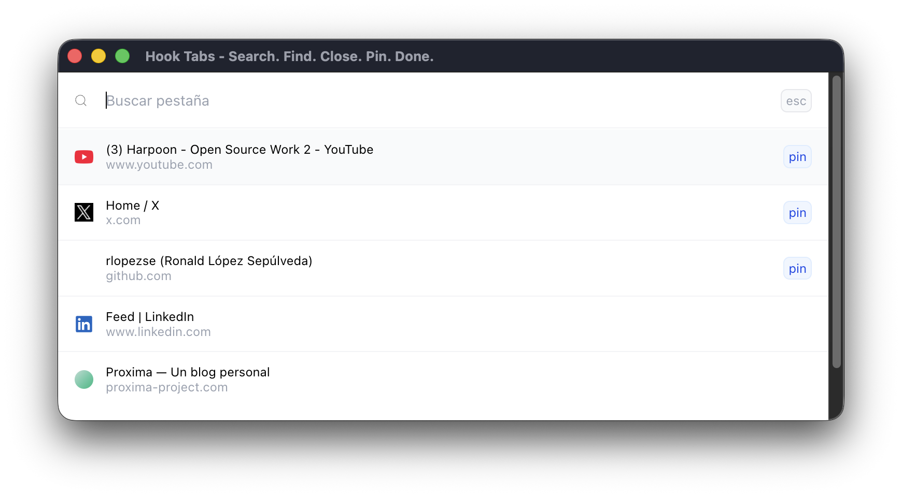

# Hook Tabs

Hook Tabs es un proyecto personal que creé porque me cansé de tener que recorrer pestaña por pestaña para encontrar una en particular, o depender del mouse para hacerlo.

La idea es bastante simple: abrir Hook Tabs, buscar lo que necesitas y listo. Puedes cambiar de pestaña, cerrarla o pinearla sin tener que andar buscando entre todas las pestañas abiertas.

Por ahora decidí mantenerlo simple y directo. Hay varias cosas que me gustaría mejorar y agregar en el futuro, pero preferí partir con algo pequeño que resolviera el problema que tenía.

### Atajos

- `←` Cerrar pestaña (`⌘Q` también funciona)
- `→` Pinear / despinear pestaña

**Busca. Encuentra. Cierra. Pinea. Listo.**
